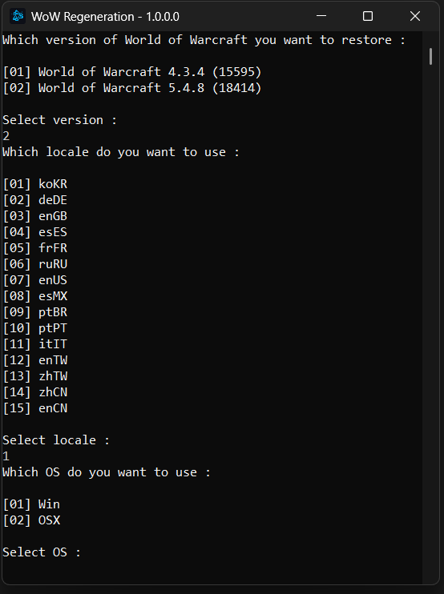

# WoWRegeneration

Mostly based on [Wow Regeneration for CATA/MOP build (15595-18414)](https://www.emucoach.com/threads/wow-regeneration-for-cata-mop-build-15595-18414.8383/)
or: [Dramacydal's wowregeneration](https://github.com/Dramacydal/wowregeneration).

Either of the above is the original creator, the origin where this current fork is based, is not the original owner.

This supports Windows and MacOS

## What does this do?

This uses Blizzard's Servers and gets the required Data (MPQs) and Locale (MPQs) files so you're able to start the game.

> [!IMPORTANT]  
> This no way of us distrubiting or condemn acquisition blizzard's Intellectual property ilegally. This only provides a place for those that wish to try emulating for themselves without having to risk themselves adquring a ilegal copy of the game and be subjagted to legal situations or virus. It's assumed that you do own the game legally and this allows you to also downloda the required patches.

## How to use this

You can either [download](https://github.com/Mists-of-Pandaria-Preservation-Project/WoWRegeneration/releases/tag/Binaries), use the [existing binary/file](https://github.com/Mists-of-Pandaria-Preservation-Project/WoWRegeneration/blob/main/Binary/WoWRegeneration.exe) or compile it yourself.

After that just run `WoWRegeneration.exe`

- You will be prompted which version you wish to pick `4.3.4 (15595)` or `5.4.8 (18414)`, you can just use the 1 numeric values (1 instead of 01) to select.
- You will be prompted after which locale you wish to download, same as above.
- You will be prompted after which Operating System you wish to download, you can run this application on windows but you can still download the MacOS one.



- After you done the above it will create a folder in the same place as the `WoWRegeneration.exe` refering to version you selected.
- When Data is done downloading, you just need to have the exectuable and correct locale configured to be able to locally use an emulator for learning purposes.
- Extract [WoW548-18414-Executable.7z](https://github.com/Mists-of-Pandaria-Preservation-Project/WoWRegeneration/releases/tag/Executable) onto your extracted Data folder e.g `WoW548-18414` and now you should have the files and `Data` folder. Make sure `WTF/Config.wtf` has the correct locale (that matches the locale you downloaded. example:

```
SET locale "enGB"
SET realmlist "127.0.0.1"
SET installLocale "enGB"
```

- Enjoy your learning experience

> [!IMPORTANT]  
> DISCLAIMER: We are not associated with anyone, even if this benefits new comers to wow emulation related to Mists of Pandaria, we are not associated with [ProjectSkyfire](https://github.com/ProjectSkyfire) or [SkyFire_548](https://github.com/ProjectSkyfire/SkyFire_548)
